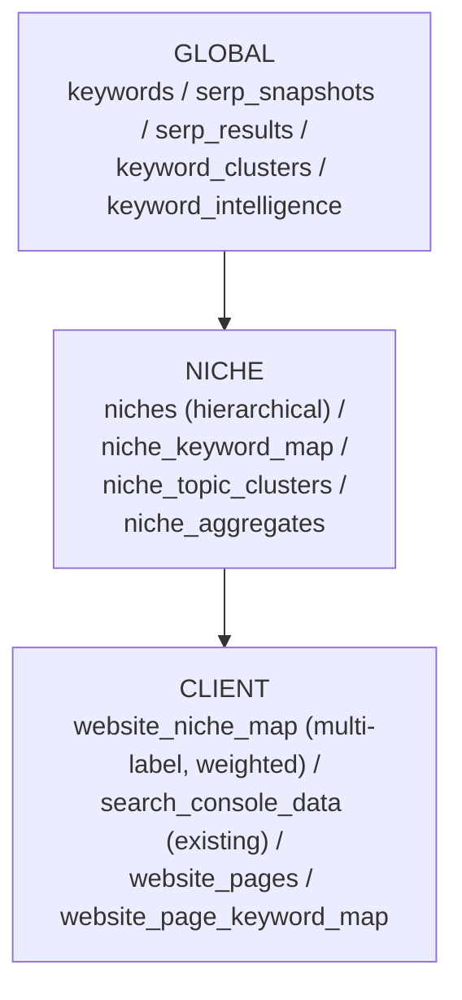
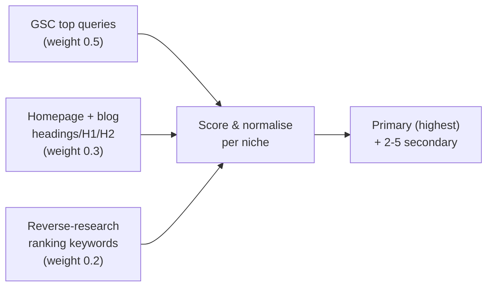

# Research Section — EBQ Portal

> Implementation plan for adding a complete SEO Research section to the EBQ portal,
> derived from `docs/research-system.docx` and adapted to the existing Laravel 12 +
> Livewire 3 + Blade stack. Multi-label hierarchical niches per product decision.

## 1. Where this fits in the existing stack

EBQ is **Laravel 12 + Livewire 3 + Blade**, multi-tenant via `Website` (owned by `User`, optionally shared via `website_user`), with `feature:*` middleware gating plan capabilities ([routes/web.php](../routes/web.php), [components/layouts/app.blade.php](../resources/views/components/layouts/app.blade.php)). We will add **one new top-level `Research` nav item** with sub-pages, a new feature flag `feature:research`, and reuse:

- [SerperSearchClient.php](../app/Services/SerperSearchClient.php) for SERP fetching.
- [KeywordsEverywhereClient.php](../app/Services/KeywordsEverywhereClient.php) for volume / CPC / competition.
- [MistralClient.php](../app/Services/Llm/MistralClient.php) (via `LlmClient` interface) for intent classification, niche detection, briefs, weakness scoring.
- [SearchConsoleData.php](../app/Models/SearchConsoleData.php) + sync job [SyncSearchConsoleData.php](../app/Jobs/SyncSearchConsoleData.php) as the per-website fact source.
- [HtmlAuditor.php](../app/Support/Audit/HtmlAuditor.php) for content extraction (headings, word count, body text).
- [TopicalAuthorityService.php](../app/Services/TopicalAuthorityService.php) — folded into the new Topic Engine.
- The existing `editor_research:v1:*` cache from [PluginInsightsController::research](../app/Http/Controllers/Api/V1/PluginInsightsController.php) — generalised into the new `ResearchAggregateService`.

The doc's "PostgreSQL + Elasticsearch + Vector DB + Redis" stack is **adapted to MySQL + DB cache + Laravel queue** (project's actual stack) without losing any feature. Embeddings start as a deferred upgrade (see §7).

---

## 2. Data Layer — three layers, hierarchical, multi-label niches



### 2.1 New migrations (under `database/migrations/`, dated `2026_05_06_*`)

**Global layer**
- `keywords` — `id`, `query`, `normalized_query`, `query_hash` (unique), `language`, `country`, `created_at`, `updated_at`. Single source of truth for keyword text.
- `keyword_intelligence` — `keyword_id` FK, `search_volume`, `cpc`, `competition`, `intent` (`informational|transactional|commercial|navigational`), `difficulty_score` (0–100), `serp_strength_score`, `volatility_score`, `last_serp_at`, `last_metrics_at`. Extends what `keyword_metrics` does today (we keep `keyword_metrics` as the KE response cache, add this richer per-keyword aggregate).
- `serp_snapshots` — `id`, `keyword_id`, `device`, `country`, `location`, `fetched_at`, `provider` (`serper`), `raw_payload_hash`. Unique on `(keyword_id, device, country, location, date(fetched_at))`.
- `serp_results` — `snapshot_id`, `rank`, `url`, `domain`, `title`, `snippet`, `result_type` (`organic|paa|featured|video|image|local|forum|news`), `is_low_quality` (bool, set by SERP weakness engine).
- `serp_features` — `snapshot_id`, `feature_type`, `payload` JSON (PAA, related searches, knowledge panel, etc.).
- `keyword_clusters` — `id`, `cluster_name`, `parent_cluster_id` (nullable, hierarchical), `centroid_keyword_id`, `signal` (`serp_overlap|text|hybrid`), `last_recomputed_at`.
- `keyword_cluster_map` — `keyword_id`, `cluster_id`, `confidence`, primary key composite.

**Niche layer**
- `niches` — `id`, `slug` (unique), `name`, `parent_id` (nullable, **hierarchical**), `is_dynamic` (bool — true if auto-discovered), `embedding` (BLOB, nullable for phase-2), `created_at`. Curated seed taxonomy ships as a seeder; auto-discovered niches get `is_dynamic=true`.
- `niche_keyword_map` — `niche_id`, `keyword_id`, `relevance_score` (0–1).
- `niche_topic_clusters` — `id`, `niche_id`, `cluster_id`, `topic_name`, `total_search_volume`, `avg_difficulty`, `priority_score`.
- `niche_aggregates` — `id`, `niche_id`, `keyword_id` (nullable; row is either keyword-level or niche-level if null), `avg_ctr_by_position` JSON, `avg_content_length`, `avg_backlinks_estimate`, `ranking_probability_score`, `sample_site_count`, `last_recomputed_at`. **Anonymised** — no `website_id`, only counts.

**Client layer (extending existing `websites` + `search_console_data`)**
- `website_niche_map` — `website_id`, `niche_id`, `weight` (0–1), `is_primary` (bool), `source` (`auto|user|hybrid`), `confidence`, `last_classified_at`. Many-to-many, **multi-label, weighted** as the user specified.
- `website_pages` — `id`, `website_id`, `url`, `url_hash`, `title`, `content_length`, `headings_json`, `body_text` (longtext), `last_crawled_at`. Rename-safe: doesn't conflict with `page_audit_reports` which is audit-runs, not pages.
- `website_page_keyword_map` — `page_id`, `keyword_id`, `source` (`gsc|content|brief`), `position_avg`, `clicks_30d`, `impressions_30d`.
- `website_internal_links` — `id`, `website_id`, `from_page_id`, `to_page_id`, `anchor_text`, `discovered_at`. Powers the Internal Linking feature.
- `keyword_alerts` — `id`, `website_id`, `keyword_id`, `type` (`ranking_drop|new_opportunity|serp_change|volatility_spike`), `payload` JSON, `severity`, `acknowledged_at`. Extends current traffic-drop alerts.

### 2.2 Backfill / migration of existing data

A one-shot command `ebq:research-backfill` will:
1. Walk distinct `(query, country)` pairs in `search_console_data` → upsert `keywords` rows + cache `keyword_id` on a new nullable `search_console_data.keyword_id` column (added in same migration with deferred FK index population).
2. Walk distinct pages from `search_console_data.page` → upsert `website_pages` (lazy crawl scheduled by `CrawlWebsitePagesJob`).
3. Seed default `niches` taxonomy.
4. Dispatch `ClassifyWebsiteNichesJob` for every existing website.

---

## 3. Niche classification — multi-label, hierarchical, continuous

Implements the "probabilistic, multi-label" model the user specified.

### 3.1 Taxonomy seeder
`database/seeders/NicheTaxonomySeeder.php` — ~120 seed niches across ~12 top-level verticals (Health → {Fitness, Nutrition, Supplements, Mental Health}, Finance → {Personal Finance, Investing, Mortgages}, SaaS → {Marketing SaaS, DevTools}, etc.). All have `is_dynamic=false`. New niches added by §3.5 are flagged `is_dynamic=true`.

### 3.2 `App\Services\Research\Niche\NicheClassificationService`

Produces a weighted ranked list per website by combining three signals:



- Map keyword → niche via `KeywordToNicheMapper`:
  - **MVP**: rule-based — niche slug aliases + `niche_keyword_map.relevance_score` curated for top 5k keywords per seed niche, plus Mistral classification for unknown keywords (cached per keyword in `keyword_intelligence`).
  - **Phase-2**: embedding similarity (`niches.embedding` + `keywords.embedding`) using Mistral embeddings or a self-hosted model — interface already abstracts this.
- Aggregate per-niche score = `Σ(relevance × signal_weight × volume_or_impressions_log)`.
- Normalise to weights summing to 1.0; primary = top, secondaries = next 2–5 above a 0.05 threshold.

### 3.3 Onboarding UX
New Livewire step in [resources/views/onboarding/](../resources/views/onboarding) after GSC connect: shows detected niches with confidence bars, lets user accept / reweight / add / remove, persists into `website_niche_map` with `source='hybrid'`. If user does nothing within 24h, classification auto-locks with `source='auto'`.

### 3.4 Continuous reclassification
- `ClassifyWebsiteNichesJob` (queueable, idempotent) dispatched: on website create, on bulk GSC sync if >20% new top-impression queries, and **monthly via scheduled `ebq:reclassify-niches`** in [routes/console.php](../routes/console.php).
- Diff-aware — only writes when weights drift >5% to avoid flapping.

### 3.5 Dynamic niche learning
`DiscoverEmergingNichesJob` (weekly): collects keywords with no good niche match (max relevance < 0.2) → clusters them via the existing clustering pipeline → if cluster size > N and persists across 4 weeks, creates a niche candidate (`is_dynamic=true`, `parent_id` set by Mistral to nearest existing parent) flagged for admin review at `/admin/research/niche-candidates`.

---

## 4. Five pipelines

All implemented as queueable jobs under `app/Jobs/Research/`, with services under `app/Services/Research/`. Reuse the existing database queue.

| # | Pipeline | Job(s) | Service | Notes |
|---|---|---|---|---|
| 1 | Keyword Expansion | `ExpandKeywordSeedJob` | `KeywordExpansionService` | Seed → Serper SERP → extract `peopleAlsoAsk`, `relatedSearches`, autocomplete via Serper `autocomplete` endpoint → upsert `keywords`. |
| 2 | SERP Ingestion | `IngestSerpForKeywordJob` | `SerpIngestionService` | Wraps `SerperSearchClient::query`, writes `serp_snapshots` + `serp_results` + `serp_features`. Dedups by `raw_payload_hash`. |
| 3 | GSC Sync (extend existing) | (existing `SyncSearchConsoleData`) + `MapGscQueriesToKeywordsJob` | `GscKeywordResolver` | Append step that resolves `(query, country)` → `keyword_id` and feeds anonymised counts to `niche_aggregates` via §6. |
| 4 | Keyword Enrichment | `EnrichKeywordJob` | `KeywordEnrichmentService` | KE volume + Mistral intent + `KeywordDifficultyEngine` + `ClusterAssignmentService` — fills `keyword_intelligence`. |
| 5 | Clustering | `ClusterKeywordsJob` (batched) | `ClusteringService` | Primary signal = SERP overlap (Jaccard on top-10 URLs from `serp_results`); secondary = token / TF-IDF similarity; phase-2 hook for embeddings. Writes `keyword_clusters` + `keyword_cluster_map`. |

**Schedule** added to [routes/console.php](../routes/console.php):
- `ebq:research-enrich-new-keywords` daily 02:00 — enrich new GSC-derived keywords.
- `ebq:research-cluster-refresh` weekly Sun 03:00 — incremental clustering.
- `ebq:reclassify-niches` monthly 1st 04:00.
- `ebq:discover-emerging-niches` weekly Mon 05:00.
- `ebq:niche-aggregates-recompute` daily 04:30.
- `ebq:research-volatility-scan` daily 06:00 (compares latest two `serp_snapshots` per tracked keyword).

---

## 5. Six intelligence engines

All under `app/Services/Research/Intelligence/`, each a small focused class with `score(...)` / `compute(...)` and a `Result` DTO. Pure-PHP scoring; LLM only where signal extraction needs it.

- **`KeywordDifficultyEngine`** — inputs: SERP composition (domain count, avg DR if known, repetition), content quality signal (avg word count, Flesch from competitor pages via `HtmlAuditor`), SERP feature density. Output: 0–100. Stored in `keyword_intelligence.difficulty_score`.
- **`OpportunityEngine`** — `Opportunity = (GSC impressions × CTR_gap × rank_improvement_potential + search_volume) ÷ SERP_competition`. CTR_gap = `niche_aggregates.avg_ctr_by_position[target_pos] − current_ctr`. Powers the "Opportunities" page and `keyword_alerts` of type `new_opportunity`.
- **`RankingProbabilityModel`** — combines difficulty, niche aggregates, and current site's domain authority signal. Bayesian: `P(top10) = σ(α + β·niche_aggregate − γ·difficulty + δ·content_match)`. Coefficients per-niche, calibrated nightly by `niche_aggregates` recompute.
- **`TopicEngine`** — wraps `keyword_clusters` + `niche_topic_clusters`; computes total demand, avg difficulty, priority = `demand × ranking_probability ÷ difficulty`. Replaces token-cooccurrence-only behaviour of [TopicalAuthorityService.php](../app/Services/TopicalAuthorityService.php) (kept as a fallback for sites without enough SERP data).
- **`ContentGapEngine`** — `competitor_keywords − site_keywords` (set diff over `serp_results.domain` + `website_page_keyword_map`). Returns missing keywords + missing topic clusters + weak-coverage pages.
- **`SerpWeaknessEngine`** — flags `serp_results.is_low_quality` when: forum/UGC domains in top 10 (Reddit, Quora, etc., curated list), low word-count competitor pages (via `HtmlAuditor` lazy-fetched and cached), thin content patterns from Mistral classification on snippets.

---

## 6. Cross-client learning (privacy-preserving)

`NicheAggregateRecomputeService` runs in `ebq:niche-aggregates-recompute`:

- For each niche, for each keyword with ≥ N (default 3) websites contributing GSC data:
  - Compute average CTR-by-position across all sites' `search_console_data` joined to `niche_keyword_map`.
  - Compute avg competitor `content_length`, `backlinks_estimate`.
  - Update `niche_aggregates` with `sample_site_count` ≥ N (privacy floor — never expose if <3 sites).
- All writes are **anonymised** — `niche_aggregates` has no `website_id`, only counts.
- A `PrivacyGuard` middleware/policy enforces that no controller ever joins client-private rows for users who don't own them; verified by a feature test `tests/Feature/Research/PrivacyIsolationTest.php`.

---

## 7. Embeddings — deferred but wired

Add nullable `embedding` BLOB columns now on `keywords` and `niches`. Behind a `RESEARCH_EMBEDDINGS_ENABLED` env flag:
- `EmbeddingProvider` interface + Mistral implementation (`/v1/embeddings`) so the existing LLM service handles both.
- Phase-1 ships rule-based + SERP-overlap; flipping the flag switches `KeywordToNicheMapper` and `ClusteringService` to embedding similarity.

---

## 8. Features — UI + APIs

All gated by `feature:research` (per-plan, set via [Plan.php](../app/Models/Plan.php)). New nav item "Research" in [components/layouts/app.blade.php](../resources/views/components/layouts/app.blade.php) `$navItems`. Each sub-page is a Blade view + Livewire component pattern matching existing sections.

### 8.1 Routes — added to [routes/web.php](../routes/web.php)

```php
Route::prefix('research')->middleware('feature:research')->name('research.')->group(function () {
    Route::view('/', 'research.index')->name('index');
    Route::view('/keywords', 'research.keywords')->name('keywords');
    Route::view('/topics', 'research.topics')->name('topics');
    Route::view('/serp', 'research.serp')->name('serp');
    Route::view('/competitors', 'research.competitors')->name('competitors');
    Route::view('/content-gap', 'research.content-gap')->name('gap');
    Route::view('/briefs', 'research.briefs')->name('briefs');
    Route::get('/briefs/{brief}', [ContentBriefController::class, 'show'])->name('briefs.show');
    Route::view('/topical-authority', 'research.topical-authority')->name('authority');
    Route::view('/coverage', 'research.coverage')->name('coverage');
    Route::view('/internal-links', 'research.internal-links')->name('internal-links');
    Route::view('/opportunities', 'research.opportunities')->name('opportunities');
    Route::view('/alerts', 'research.alerts')->name('alerts');
    Route::view('/reverse', 'research.reverse')->name('reverse');
});
```

### 8.2 Livewire components (under `app/Livewire/Research/`) and what they map to

- **`KeywordResearch`** — search box → calls `KeywordExpansionService` (sync for first SERP, async for full enrichment), table showing volume / difficulty / intent / cluster, save-to-list button.
- **`TopicExplorer`** — niche selector, tree of `keyword_clusters`, demand/difficulty/priority bars (powered by `TopicEngine`).
- **`ReverseKeywordResearch`** — URL or domain input → uses `serp_results` index (domain → snapshots → keyword_ids) + estimates traffic via `niche_aggregates.avg_ctr_by_position[position]`.
- **`SerpAnalysis`** — keyword input → latest `serp_snapshots` view: top results with content patterns (avg word count, common headings via lazy `HtmlAuditor`), SERP composition pie, weakness flags.
- **`CompetitorIntelligence`** — input domain → top pages, keyword universe (paginated `serp_results`), topic dominance bars across niches.
- **`ContentGap`** — picks site + competitors → `ContentGapEngine` output: missing keywords, missing clusters, weak pages.
- **`ContentBriefGenerator`** — keyword → `ContentBriefService` (Mistral-backed, reuses existing `AiContentBriefService` patterns) producing titles, headings (H2/H3), keyword usage, PAA-derived questions, target word count from `niche_aggregates`. Persists to a new `content_briefs` table (`id`, `website_id`, `keyword_id`, `payload` JSON, `created_by`).
- **`InternalLinkSuggestions`** — for a target page, suggests source pages from `website_pages` containing the target's primary keywords as anchor candidates; writes proposed links to `website_internal_links` for user accept/reject.
- **`PerformanceTracking`** — re-uses existing rank tracking + GSC, but adds CTR-trend vs niche benchmark from `niche_aggregates`.
- **`AlertsCenter`** — lists `keyword_alerts` (ranking drops, new opportunities, SERP changes, volatility spikes); ack/dismiss; integrates with existing notifications.
- **`TopicalAuthorityGraph`** — interactive D3-via-CDN tree of `niche_topic_clusters` for the site; coverage colouring from `website_page_keyword_map`; "missing clusters" call-out.
- **`CoverageScore`** — page selector → score = `min(1, covered_subtopics / niche_avg_subtopics)` × heading-match × keyword-depth. Comparison vs top-3 competitor pages (lazy fetch via `HtmlAuditor`).
- **`OpportunityFeed`** — `OpportunityEngine` ranked list, "quick wins" (impressions ≥ 100, position 5–15, CTR < niche benchmark).

### 8.3 API (extend `routes/api.php` v1)

A small `ResearchApiController` exposes the same data to the WP plugin and to admin tooling: `/api/v1/research/keywords/expand`, `/api/v1/research/serp`, `/api/v1/research/briefs`, `/api/v1/research/opportunities`. The existing `PluginInsightsController::research` becomes a thin proxy to `ResearchAggregateService` so the plugin and portal share a single bundle definition.

---

## 9. Alerts (extending the existing system)

[DetectTrafficDrops.php](../app/Console/Commands/DetectTrafficDrops.php) (and its job) is generalised into `DetectResearchSignalsJob` that emits four alert types into `keyword_alerts`:
- `ranking_drop` — current rank vs 7-day prior in `rank_tracking_snapshots`.
- `new_opportunity` — `OpportunityEngine` score crosses threshold.
- `serp_change` — top-10 URL set Jaccard < 0.5 between consecutive `serp_snapshots`.
- `volatility_spike` — `keyword_intelligence.volatility_score` z-score > 2.

---

## 10. Plan / quota / cost guardrails

- New `feature:research` flag in `TeamPermissions::FEATURES` and `Plan` `features` JSON.
- Per-plan quotas in a new `plan_research_limits` JSON column on `plans`: `monthly_keyword_lookups`, `monthly_serp_fetches`, `monthly_briefs`, `competitor_domains_max`. Enforced via a new `ResearchQuotaService` that wraps every Serper / KE / Mistral call and throws a 402 on overage (matches existing API tier-gate pattern).
- Cost telemetry hooks already exist in [config/services.php](../config/services.php) (`cost_per_call_usd`, `cost_per_keyword_usd`, Mistral per-million pricing). New `ResearchCostLogger` writes per-feature costs to `client_activities`.

---

## 11. Testing & rollout

- Feature tests per engine and pipeline in `tests/Feature/Research/`.
- Privacy isolation test (§6) is gating — must pass before rollout.
- Roll out in stages behind `feature:research`: enable for an internal admin website first, then a small cohort, then GA.

---

## 12. File map (high-level)

```
app/
  Jobs/Research/
    ExpandKeywordSeedJob.php
    IngestSerpForKeywordJob.php
    MapGscQueriesToKeywordsJob.php
    EnrichKeywordJob.php
    ClusterKeywordsJob.php
    ClassifyWebsiteNichesJob.php
    DiscoverEmergingNichesJob.php
    NicheAggregateRecomputeJob.php
    DetectResearchSignalsJob.php
    CrawlWebsitePagesJob.php
  Services/Research/
    KeywordExpansionService.php
    SerpIngestionService.php
    GscKeywordResolver.php
    KeywordEnrichmentService.php
    ClusteringService.php
    ResearchAggregateService.php
    ContentBriefService.php
    InternalLinkSuggestionService.php
    Niche/
      NicheClassificationService.php
      KeywordToNicheMapper.php
      EmbeddingProvider.php
    Intelligence/
      KeywordDifficultyEngine.php
      OpportunityEngine.php
      RankingProbabilityModel.php
      TopicEngine.php
      ContentGapEngine.php
      SerpWeaknessEngine.php
    Privacy/
      PrivacyGuard.php
    Quota/
      ResearchQuotaService.php
      ResearchCostLogger.php
  Livewire/Research/
    (one component per page in §8.2)
  Console/Commands/Research/
    ResearchBackfill.php
    ReclassifyNiches.php
    EnrichNewKeywords.php
    ClusterRefresh.php
    DiscoverEmergingNiches.php
    RecomputeNicheAggregates.php
    VolatilityScan.php
  Models/Research/
    Keyword.php / KeywordIntelligence.php / SerpSnapshot.php / SerpResult.php /
    KeywordCluster.php / Niche.php / NicheKeywordMap.php / NicheTopicCluster.php /
    NicheAggregate.php / WebsiteNiche.php / WebsitePage.php / WebsitePageKeyword.php /
    WebsiteInternalLink.php / KeywordAlert.php / ContentBrief.php
database/
  migrations/2026_05_06_*  (15+ migrations listed in §2.1)
  seeders/NicheTaxonomySeeder.php
resources/
  views/research/  (one Blade per Livewire component)
  views/livewire/research/
routes/
  web.php   (additions in §8.1)
  api.php   (research endpoints in §8.3)
  console.php  (schedule additions in §4)
```

This delivers every feature from the doc — Keyword Research, Topic Suggestions, Reverse Research, SERP Analysis, Content Gap, Brief Generator, Internal Linking, Performance Tracking, Alerts, Cross-Client Learning, Predictive Insights (RankingProbability), Topical Authority Graph, Coverage Score, SERP Volatility, Competitor Intelligence — and all four user workflows from §8 of the doc map to the Livewire pages above.

---

## 13. Implementation checklist

1. **Data layer** — migrations for global / niche / client tables (see §2.1) + models + `keyword_id` backfill column on `search_console_data`.
2. **Niche taxonomy** — seed hierarchical taxonomy (~120 niches across ~12 verticals) via `NicheTaxonomySeeder`; admin review screen for dynamically-discovered niches.
3. **Niche classification** — `NicheClassificationService` + `KeywordToNicheMapper` (rule-based MVP, embedding hook), `ClassifyWebsiteNichesJob`, onboarding Livewire confirm/edit step.
4. **Pipelines** — five services + jobs (Keyword Expansion, SERP Ingestion, GSC Resolver, Enrichment, Clustering).
5. **Intelligence engines** — six classes under `Services/Research/Intelligence/`.
6. **Cross-client aggregates** — recompute service + `PrivacyGuard` + isolation feature test (`sample_site_count >= 3` floor).
7. **Schedules** — six new entries in `routes/console.php` (see §4).
8. **UI hub** — Research nav item, `/research` routes, `feature:research` flag, all Livewire components in §8.2.
9. **Alerts** — `DetectResearchSignalsJob` emitting four alert types into `keyword_alerts`.
10. **API** — `ResearchApiController` under `api/v1`; refactor `PluginInsightsController::research` to proxy `ResearchAggregateService`.
11. **Quota / cost** — `plan_research_limits` JSON column, `ResearchQuotaService`, `ResearchCostLogger`.
12. **Backfill** — `ebq:research-backfill` command.
13. **Embeddings hook** — `EmbeddingProvider` interface + Mistral implementation behind `RESEARCH_EMBEDDINGS_ENABLED`.
14. **Tests + rollout** — feature tests per engine and pipeline; staged rollout behind `feature:research` (internal → cohort → GA).
